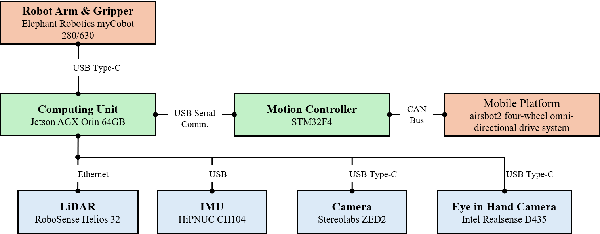
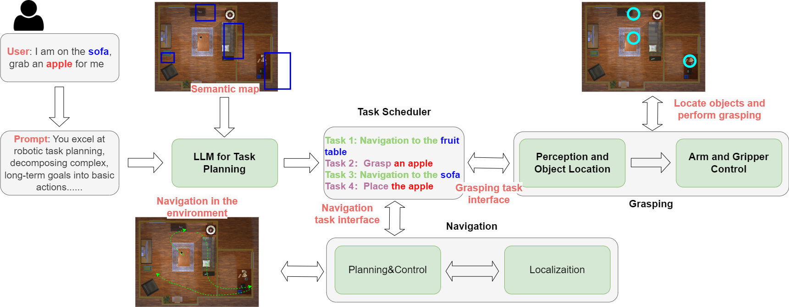
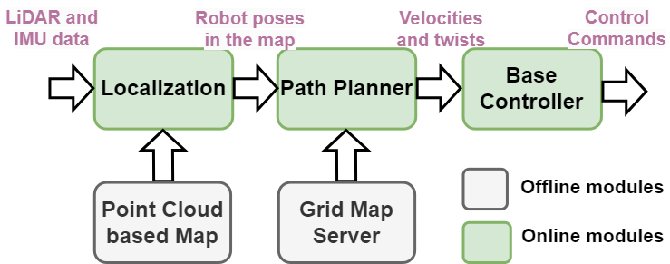
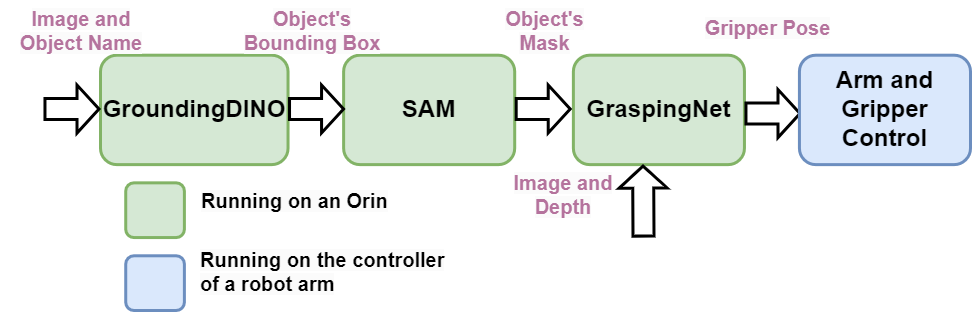

# AIRSHIP: Empowering Intelligent Robots through Embodied AI, Stronger United, Yet Distinct.

Welcome to AIRSHIP GitHub page!
[AIRSHIP](https://airs.cuhk.edu.cn/en/airship) is an open-sourced embodied AI robotic software stack to empower various forms of intelligent robots. 

Official website is [here](https://airs.cuhk.edu.cn/en/airship). Videos about the system design can be found [here](https://www.youtube.com/watch?v=MnlVE-DqtIk&t=8s). 

## Table of Contents

1. [Introduction](#introduction)
2. [Prerequisites](#prerequisits)
3. [Hardware Architecture](#hardware-architecture)
4. [Software Architecture](#software-architecture)
5. [Modules and Folders](#modules-and-folders)
6. [System Setup](#system-setup)
7. [Quick Starts](#quick-starts)
8. [Acknowledgement](#acknowledgement)

## Introduction
While embodied AI holds immense potential for shaping the future economy, it presents significant challenges, particularly in the realm of computing. Achieving the necessary flexibility, efficiency, and scalability demands sophisticated computational resources, but the most pressing challenge remains software complexity. Complexity often leads to inflexibility. 

Embodied AI systems must seamlessly integrate a wide array of functionalities, from environmental perception and physical interaction to the execution of complex tasks. This requires the harmonious operation of components such as sensor data analysis, advanced algorithmic processing, and precise actuator control. To support the diverse range of robotic forms and their specific tasks, a versatile and adaptable software stack is essential. However, creating a unified software architecture that ensures cohesive operation across these varied elements introduces substantial complexity, making it difficult to build a streamlined and efficient software ecosystem.

AIRSHIP has been developed to tackle the problem of software complexity in embodied AI. Its mission is to provide an easy-to-deploy software stack that empowers a wide variety of intelligent robots, thereby facilitating scalability and accelerating the commercialization of the embodied AI sector. AIRSHIP takes inspiration from Android, which played a crucial role in the mobile computing revolution by offering an open-source, flexible platform. Android enabled a wide range of device manufacturers to create smartphones and tablets at different price points, sparking rapid innovation and competition. This led to the widespread availability of affordable and powerful mobile devices. Android's robust ecosystem, supported by a vast library of apps through the Google Play Store, allowed developers to reach a global audience, significantly advancing mobile technology adoption.

Similarly, AIRSHIP's vision is to empower robot builders by providing an open-source embodied AI software stack. This platform enables the creation of truly intelligent robots capable of performing a variety of tasks that were previously unattainable at a reasonable cost. AIRSHIP’s motto, "Stronger United, Yet Distinct," embodies the belief that true intelligence emerges through integration, but such integration should enhance, not constrain, the creative possibilities for robotic designers, allowing for distinct and innovative designs.

To realize this vision, AIRSHIP has been designed with flexibility, extensibility, and intelligence at its core. In this release, AIRSHIP offers both software and hardware specifications, enabling robotic builders to develop complete embodied AI systems for a range of scenarios, including home, retail, and warehouse environments. AIRSHIP is capable of understanding natural language instructions and executing navigation and grasping tasks based on those instructions. The current AIRSHIP robot form factor features a hybrid design that includes a wheeled chassis, a robotic arm, a suite of sensors, and an embedded computing system. However, AIRSHIP is rapidly evolving, with plans to support many more form factors in the near future. The software architecture follows a hierarchical and modular design, incorporating large model capabilities into traditional robot software stacks. This modularity allows developers to customize the AIRSHIP software and swap out modules to meet specific application requirements.

AIRSHIP is distinguished by the following characteristics:
* It is an integrated, open-source embodied robot system that provides detailed hardware specifications and software components.
* It features a modular and flexible software system, where modules can be adapted or replaced for different applications.
* While it is empowered by large models, AIRSHIP maintains computational efficiency, with most software modules running on an embedded computing system, ensuring the system remains performant and accessible for various use cases.

## Prerequisits
### Computing platform
  * Nvidia Jetson Orin AGX
### Sensors
  * IMU: HiPNUC CH104 9-axis IMU
  * RGBD camera for grasping: Intel RealSense D435
  * LiDAR: RoboSense Helios 32
  * RGBD camera for navigation: Stereo Labs Zed2 
### Wheeled robot
  * [AirsBot2](https://airs.cuhk.edu.cn/en/airship)
### Robotic arm and gripper
  * Elephant Robotics mycobot 630
### Software on Jetson Orin AGX
  * Jetpack SDK 6.0 
  * Ubuntu 22.04
  * ROS Humble
  * python 3.10
  * pytorch 2.3.0

## Hardware Architecture
The AIRSHIP hybrid robot comprises a wheeled chassis, a robotic arm with a compatible gripper, an Nvidia Orin computing board, and a sensor suite including a LiDAR, a camera, and an RGBD camera. Detailed hardware specifications are provided in this file. The following figure illustrates the AIRSHIP robot's hardware architecture.



## Software Architecture
AIRSHIP is designed for scenarios that can be decomposed into sequential navigation and grasping tasks. Leveraging state-of-the-art language and vision foundation models, AIRSHIP augments traditional robotics with embodied AI capabilities, including high-level human instruction comprehension and scene understanding. It integrates these foundation models into existing robotic navigation and grasping software stacks.



The software architecture, illustrated in the above figure, employs an LLM to interpret high-level human instructions and break them down into a series of basic navigation and grasping actions. Navigation is accomplished using a traditional robotic navigation stack encompassing mapping, localization, path planning, and chassis control. The semantic map translates semantic objects into map locations, bridging high-level navigation goals with low-level robotic actions. Grasping is achieved through a neural network that determines gripper pose from visual input, followed by traditional robotic arm control for execution. A vision foundation model performs zero-shot object segmentation, converting semantic grasping tasks into vision-based ones.

### Navigation Software
The navigation software pipeline operates as follows. The localization module fuses LiDAR and IMU data to produce robust odometry and accurately determines the robot's position within a pre-built point cloud map. The path planning module generates collision-free trajectories using both global and local planners. Subsequently, the path planner provides velocity and twist commands to the base controller, which ultimately produces control signals to follow the planned path.



### Grasping Software
The grasping software pipeline operates as follows: GroundingDINO receives an image and object name, outputting the object's bounding box within the image. SAM utilizes this bounding box to generate a pixel-level object mask. GraspingNet processes the RGB and depth images to produce potential gripper poses for all objects in the scene. The object mask filters these poses to identify the optimal grasp for the target object.



## Modules and Folders
* airship_chat: the voice user interface module, translating spoken language into text-based instructions
* airship_grasping: the grasping module
* airship_interface: defines topics and services messages used by each module
* airship_localization: the localization module
* airship_navigation: the planning and control module
* airship_perception: the object detection and segmentation module
* airship_planner: the LLM based task planner module
* airship_object: the senamic map module
* airship_description: contains the urdf file, defining the external parameter of robot links. 
* docs: system setup on Orin without docker
* script: scripts for installing ros and docker

## System Setup

If you don't want to use docker, please refer to the setup instruction in "./docs/README.md".

### System setup on Nvidia Orin with Docker
0. Log in to your Nvidia Orin.
1. Install Docker and NVIDIA Container Toolkit
```
bash script/software_setup/install_docker.sh
```

2. Pull Docker image
* [BaiDuYun_download_link](https://pan.baidu.com/s/1PqKPJXVOEegFnDOlRRsk4Q?pwd=39mz)
* [Onedrive_download_link](https://cuhko365-my.sharepoint.com/:u:/g/personal/shaopengtao_cuhk_edu_cn/EaBtYNHriv9BhuS0pGesCGMB4ReneHuF_ywH81H_lRU81g?e=s1UzEq)
```shell
sudo systemctl enable docker
sudo systemctl start docker
docker load -i airship_image.tar
docker images
```

3. Create Docker container
```shell
xhost + 
docker run -it --runtime=nvidia --gpus all --privileged --network=host -e DISPLAY=$DISPLAY -v /dev:/dev -v ${local_address_you_wish_to_map}:/home/airsbot2/airship/ --name docker_airship -d ${image_id_pull_above}
docker start docker_airship
docker exec -it docker_airship /bin/bash
```

4. Download AIRSHIP package from GitHub
```shell
# ${DIR_AIRSHIP} is the directory you create for AIRSHIP pakcage
mkdir -p ${DIR_AIRSHIP}/src
cd ${DIR_AIRSHIP}/src
git clone https://github.com/airs-admin/airship.git
```
5. Download dependencies and weights
* airship_grasp
```shell
cd ${DIR_AIRSHIP}/src/airship/airship_grasp/lib
git clone https://github.com/mahaoxiang822/Scale-Balanced-Grasp
mv Scale-Balanced-Grasp Scale_Balanced_Grasp
cd Scale_Balanced_Grasp
cp ${DIR_AIRSHIP}/src/airship/airship_grasp/doc/3rd_party/requirements.txt requirements.txt
```

Download the tolerance labels from [Google Drive](https://drive.google.com/file/d/1DcjGGhZIJsxd61719N0iWA7L6vNEK0ci/view?usp=sharing)/[Baidu Pan](https://pan.baidu.com/s/1HN29P-csHavJF-R_wec6SQ) and run:
```shell
mkdir logs
mv tolerance.tar logs/
cd logs
tar -xvf tolerance.tar
```

```shell
# Replace files in knn
cp ${DIR_AIRSHIP}/src/airship/airship_grasp/doc/3rd_party/knn.h src/knn.h 
cp ${DIR_AIRSHIP}/src/airship/airship_grasp/doc/3rd_party/vision.h src/cuda/vision.h

# Download graspnetAPI
cd ..
git clone https://github.com/graspnet/graspnetAPI
cd graspnetAPI
cp ${DIR_AIRSHIP}/src/airship/airship_grasp/doc/3rd_party/setup.py setup.py

# Download Elephant robot's API
cd ../..
git clone https://github.com/elephantrobotics/pymycobot.git
```

* airship_navigation
```shell
# Install local planner
## airship_navigation utilizes neo_local_planner2 as the local planner. We retrieve the code from Neobotix's GitHub repository and compile it from the source.
cd ${DIR_AIRSHIP}/src
git clone https://github.com/neobotix/neo_local_planner2.git -b humble
```

* airship_perception

```shell
# Install Grounded-Segment-Anything
cd ${DIR_AIRSHIP}/src
vcs-import < airship/dependencies.yaml
cp -r ${DIR_AIRSHIP}/src/Grounded-Segment-Anything/* ${DIR_AIRSHIP}/src/airship/airship_perception/lib/

# Download weights
cd ${DIR_AIRSHIP}/src/airship/airship_perception/lib
mkdir models
cd models

# Download bert weights
git lfs install
git clone https://huggingface.co/google-bert/bert-base-uncased

# Download groundingdino weights
wget https://github.com/IDEA-Research/GroundingDINO/releases/download/v0.1.0-alpha/groundingdino_swint_ogc.pth

# Download sam weights
wget https://dl.fbaipublicfiles.com/segment_anything/sam_vit_h_4b8939.pth
```

### System setup on Elephant robot
0. Log in to Raspberry Pi controler
1. Python environment setup
```shell
sudo wget http://repo.continuum.io/miniconda/Miniconda3-py39_4.9.2-Linux-aarch64.sh
sudo /bin/bash Miniconda3-py39_4.9.2-Linux-aarch64.sh
conda create -n elephant_grasp python=3.10.12
conda activate elephant_grasp
```
2. Install robot arm and gipper control software
```shell
git clone https://github.com/elephantrobotics/pymycobot.git
cd pymycobot
pip install .
```

### System setup on your local server for LLM model
AIRSHIP utilizes an LLM for instruction understanding and task planning. You can integrate any public LLM, such as GPT-4 or Gemini, into AIRSHIP, provided the LLM's API is accessible. If you choose to use a public LLM, the setup for a dedicated LLM component can be omitted.

We use [Ollama](www.ollama.com) to provide LLM service. 

* Prerequisites: 
  * A properly configured local network.
  * Lamma3.1 70B model.
  * A server equipped with powerful Nvidia GPUs. We have successfully run LLaMA 3.1 70B on two Nvidia A1000 cards.

* Ollama configurations
```shell
curl -fsSL https://ollama.com/install.sh | sh
sudo systemctl status ollama
ollama -v # successfull if the status shows running

# Modify the configuration file
sudo vim /etc/systemd/system/ollama.service
# Based on the following Settings, ollama enables listening to any source IP and defines the model storage location
Environment="OLLAMA_HOST=0.0.0.0"  
Environment="OLLAMA_MODELS=/your_data/ollama/models" 

# Restart ollama
sudo systemctl daemon-reload
sudo systemctl restart ollama

# If writing to the configuration file fails, you can try using direct open
# Note: written after each restart
# export OLLAMA_HOST="0.0.0.0:11434"

# Download Lamma3.1
ollama run llama3.1:70b

# Accessed in a browser, the configuration is successful if it shows ollama is running.
your-ip:11434 # 11434 is the port of ollama
your-ip:11434/api/chat # ollama exposes the interface

# If the preceding ports are enabled but still cannot be accessed through the IP address, configure Intranet penetration
# Using ngrok as an example, you can choose another one
# Download a standalone executable with zero run time dependencies, the example here is the X86-64 version
https://dashboard.ngrok.com/get-started/setup/linux
# In a terminal, extract ngrok
sudo tar -xvzf ~/Downloads/https://bin.equinox.io/c/bNyj1mQVY4c/ngrok-v3-stable-linux-amd64.tgz -C /usr/local/bin
# Run the following command to add your authtoken to the default ngrok.yml configuration file
ngrok config add-authtoken your-authtoken
# Enable Intranet penetration on port 11434
ngrok http 11434
# Obtain the ip address after forwarding
https://xxxxxx.ngrok-free.app
https://xxxxxx.ngrok-free.app/api/chat # ollama exposes the interface

# Replace the interface address in the code, you can use ip access, or Intranet penetration access
url = "your-ip:11434/api/chat"
   or
url = "https://xxxxxx.ngrok-free.app/api/chat"
```

# Quick Starts

## Compile in docker
```
cd ${DIR_AIRSHIP}
source /opt/ros/humble/setup.bash

conda deactivate
colcon build --cmake-args -DCMAKE_BUILD_TYPE=Release --symlink-install --packages-up-to neo_local_planner2 airship_chat airship_description airship_interface airship_localization airship_navigation airship_object airship_planner

conda activate airship_perception
colcon build --cmake-args -DCMAKE_BUILD_TYPE=Release --symlink-install --packages-up-to airship_perception

conda activate airship_grasp
colcon build --cmake-args -DCMAKE_BUILD_TYPE=Release --symlink-install --packages-up-to airship_grasp
```

## Run
### LLM Task Demo
* enter docker
```shell
docker start airship_docker
# Remember to enter docker when open a new termial.
docker exec -it airship_docker /bin/bash
```

* start sensor
```shell
ros2 launch rslidar_sdk start.py
# Open new termial
ros2 launch hipnuc_imu imu_spec_msg.launch.py
```

* airship_loc
```shell
cd ${DIR_AIRSHIP}
source install/local_setup.bash
ros2 launch airship_localization airship_localization_2d.launch.py load_state_filename:=${DIR_AIRSHIP}/src/airship/airship_localization/map/map.pbstream
```

* airship_navigation
```shell
cd ${DIR_AIRSHIP}
source install/local_setup.bash
ros2 launch airship_navigation airship_navigation.launch.py 
# You can use the service to send a movement command, for example, to move forward by 0.5 meters (in another terminal).
cd ${DIR_AIRSHIP}
source install/local_setup.bash
ros2 service call /airship_navigation/navigate_to_pose airship_interface/srv/AirshipNav "{x: 0.5, y: 0.0, theta: 0.0}"
```

* airship_preception
```shell
cd ${DIR_AIRSHIP}
source install/local_setup.bash
conda activate airship_perception
ros2 launch airship_perception run_airship_perception_node.launch.py
```

* airship_grasp
```shell
cd ${DIR_AIRSHIP}
source install/local_setup.bash
conda activate airship_grasp
ros2 launch airship_grasp grasp.launch.py
```

* airship_planner
```shell
cd ${DIR_AIRSHIP}
source install/local_setup.bash
# Remember to start LLM service in remote server. Update your llm_server_url address in "airship_planner.yaml".
ros2 launch airship_planner airship_planner_launch.py
# You can use the service to send a command (in another terminal).
ros2 service call /airship_grasp/grasp_server airship_interface/srv/AirshipGrasp "{task: pick, obj:apple}"
```

* airship_chat
```shell
# Optional. You can also use airship_chat to send a command in voice.
cd ${DIR_AIRSHIP}
source install/local_setup.bash
# Remember to setup your microphone device and update your openai_api_key.
ros2 launch airship_chat run_airship_chat_node.launch.py
```

# Acknowledgement
* https://github.com/ros2/cartographer
* https://github.com/ros2/cartographer_ros
* https://github.com/mahaoxiang822/Scale-Balanced-Grasp
* https://github.com/neobotix/neo_local_planner2.git
* https://huggingface.co/google-bert/bert-base-uncased
* https://github.com/IDEA-Research/GroundingDINO/
* https://github.com/ollama/ollama
* https://www.open3d.org/
