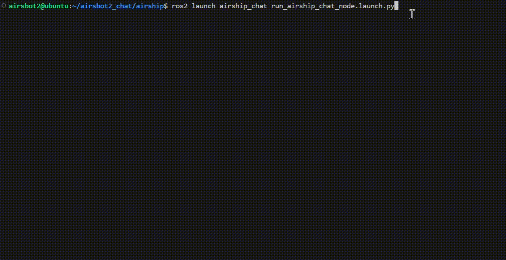

# airship_chat
**This project is an intelligent voice interaction system that allows users to conveniently control robots to perform tasks through voice commands. Design details can be found in this [video](https://www.youtube.com/watch?v=ushMzCUC4-g).**

## airship_chai API Overview
### chatbot_node
* default config: airship_chat/config/config.yaml
1. Audio record 
* `speech_record_path`: Upon detecting the default wake word "AIRSHIP", the system initiates audio recording when the speaking volume exceeds 2000 decibels. Recording ceases and the audio file is saved once silence (i.e., no speech) persists for more than one second. (Default: `airship_chat/lib/speech_record.wav`)
  
2. Wake-up prompt tone
* `wakeup_audio_path`: When the wake word is detected, the system plays a 1-second prompt audio by default to alert the user that the voice system has been activated and is ready to receive commands. (Default: `airship_chat/lib/wakeup.wav`) 
  
3. Player device
* `player_device_index`: The index of the playback device used to play audio.You can use `aplay -l` to check the device index. (Default: `hw:3,0`)

4. Sphinx_model
* We employ PocketSphinx to implement voice wake-up capabilities, with the default wake word configured as "AIRSHIP". To customize the wake word, visit the [official website](http://www.speech.cs.cmu.edu/tools/lmtool-new.html) to create and download your own PocketSphinx model, then adjust the relevant configuration settings.
* `sphinx_model_path`: The path of PocketSphinx model. (Default: `airship_chat/lib/Sphinx_airship`)
* `sphinx_model_name`: The prefix of the PocketSphinx model name. (Default: `2747`)
  
5. OpenAI API
* We use OpenAI Whisper, an automatic speech recognition (ASR) system, for the task of converting speech into text.So you need an active OpenAI account to access the Whisper API.
* `openai_api_key`: Your API key of OpenAI.
* `openai_base_url`: The base URL for OpenAI API. (Default: `https://api.openai.com/v1`)

## To Do List
- [ ]  Reduction of speech-to-text conversion time.
- [ ]  Implementing voice interaction without the need for wake-up words.

  

