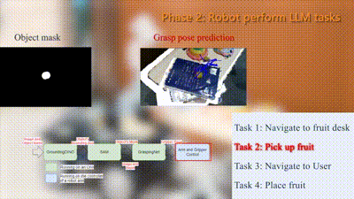

# Airship_grasp
**This module is a grasping system that integrates RGB and depth data from a camera to enable precise object manipulation. It utilizes a segmentation service to identify relevant objects and a grasp pose estimation algorithm to select the optimal grasping point, facilitating the automation of pick-and-place operations with a robotic arm. Design details can be found in this [video](https://www.youtube.com/watch?v=EuKlE1woDns).**

## Airship_grasp API Overview
### grasp_server_node
* default config: airship_grasp/config/airship_grasp_config.yaml
1. Service
  * `/airship_grasp/grasp_server`: Provides a service for the planner to invoke for picking object or placement.
  * `/airship_perception/SegmentationGrasping`: Provides a service to the grasping node for acquiring object's mask.
2. Parameters
  * `fx,fy,cx,cy`: D435i camera intrinsic.(Default: `none`)
  * `image_width`: The image width of depth and color images.(Default: `none`)
  * `image_height`: The image height of depth and color images.(Default: `none`)
  * `depth_scale`: The conversion factor between the depth values  and the actual physical distance.(Default: `1000.0`)
  * `model_checkpoint_path`: The path to the weight files for the GraspNet module.(Default: '/home/airsbot2/airsbot2_grasp/grasp_test/src/airship_grasp/lib/Scale_Balanced_Grasp/logs/log_full_model/checkpoint.tar')
  * `expand_mask_height`: The height of the area selected around the object mask.(Default: `none`)
  * `expand_mask_width`:The width of the area selected around the object mask.(Default: `none`)
  * `num_points`: The maximum number of points recovered from the depth image.(Default: `20000`)
  * `num_grasp_pose`: The number of preliminary  selected grasp poses.(Default: `10`)
  * `ip`: The IP address of the elephant robot.(Default: `none`)
  * `port`: The port of the elephant robot.(Default: `9000`)
  * `arm_maximum_reach`: The maximum distance of objects that the Elephant Robot can grasp.(Default: `380`)
  * `max_angle_select`: The maximum value of the yaw angle for the final grasp pose selection.(Default: `-60`)
  * `min_angle_select`: The minimum value of the yaw angle for the final grasp pose selection.(Default: `-120`)
  * `cam2real_gripper_xyzrpy`: The transformation between the camera and the gripper coordinates.(Default: `none`)
  * `est2virtual_gripper_xyzrpy`: The transformation between the assumed coordinate for GraspNet and the actual coordinate system of the real gripper.(Default: `[0.04, 0.0, 0.0, 90.0, 0.0, 90.0]`)
  * `debug_mode`：The visualization window used for debugging the grasping results of GraspNet.(Default: `False`)

## To Do List
- [ ]  Optimize the grasp pose estimation algorithm.
- [ ]  Adaptively select the area surrounding the mask for grasp pose selection.
- [ ]  Consider the future handling of soft objects and adjust the gripper adaptively for grasping.
