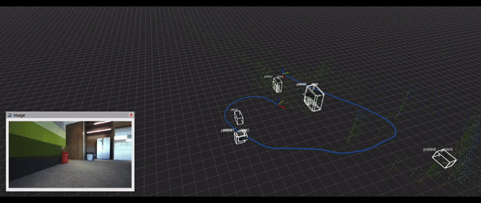
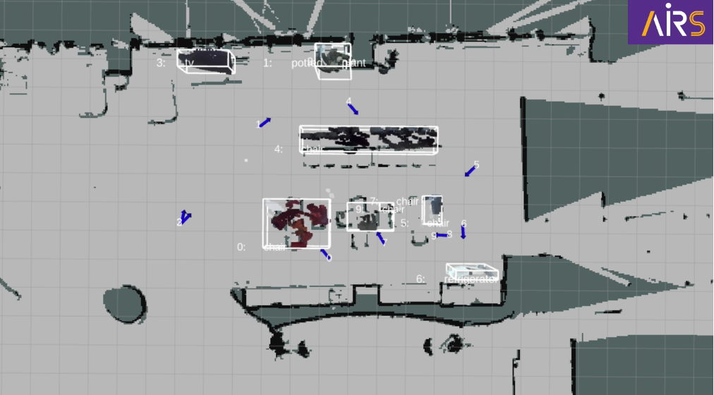

# airship_object
**This project integrates pose estimation and RGB-D cameras to achieve semantic segmentation and localization of objects in the environment. By utilizing point cloud clustering and grouping algorithms, the project accomplishes the annotation of objects in three-dimensional space, which is used to generate object navigation points. Design details can be found in this [video](https://www.youtube.com/watch?v=TzeuzeWfSLo).**



## airship_object API Overview
### object_map_node
* default config: airship_object/config/config.yaml

1. Subscribed Topics
* `topic_sub_depth`: Subscribes to depth information for object localization. (Default: `/zed/zed_node/depth/depth_registered`)
* `topic_sub_image`: Receives image data from visual sensors to be used for object segmentation. (Default: `/zed/zed_node/left_gray/image_rect_gray`)
* `topic_sub_odometry`: Collects odometry data to track the robot’s movement and position over time for object map creation. (Default: `/tracked_pose`)

2. Published Topics
* `topic_pub_keyframe_cloud`: Publishes point cloud data based on keyframes. (Default: `/airship_object/keyframe_cloud`)
* `topic_pub_keyframe_marker`: Publishes bounding boxes based on keyframes, without clustering and segmentation. (Default: `/airship_object/keyframe_marker`)
* `topic_pub_object_marker`: Publishes bounding boxes based on keyframes, with clustering and segmentation. (Default: `/airship_object/object_marker`)
* `topic_pub_object_nav_goal_marker`: Publishes markers indicating navigation goals associated with detected objects. (Default: `/airship_object/object_nav_goal_marker`)
* `topic_pub_object_segmentation`: Publishes object segmemtation results. (Default: `/airship_object/object_segmentation`)

3. Service
* `/airship_object/save_object_nav_goal`: Provides a service to save navigation goals linked to specific objects.
``` 
# The following example save object navigation goal in `/home/airsbot2/nav_goal.yaml`.
export PATH_NAV_GOAL_YAML=/home/airsbot2/nav_goal.yaml
ros2 service call /airship_object/save_object_nav_goal airship_interface/srv/SaveObjectNavGoal "{path_nav_goal_list: '${PATH_NAV_GOAL_YAML}'}"
```

In the figure, the blue arrow represents the navigation endpoint for a certain object, including the X, Y coordinates and directional information.



4. Parameters
* `message_type_odomtry`: The message type of pose estimation currently supports nav_msgs/Odometry and geometry_msgs/PoseStamped. (Default: `PoseStamped`)
* `path_config_object_depth`: The configuration path for lib/object_depth. (Default: `config_object_depth.yaml`)
* `path_config_segmentation_service_client`: The configuration path for lib/segmentation_service_client. (Default: `config_segmentation_service_client.yaml`)

### lib/object_depth
* default config: airship_object/config/config_object_depth_zed2.yaml

1. Parameters
* `K`: Depth camera intrinsic. (Default: `none`)
* `image_width`: The image width of depth maps and object segmentation images. (Default: `none`)
* `image_height`: The image height of depth maps and object segmentation images. (Default: `none`)
* `R`: The extrinsic parameters, rotation component, from camera_optical_frame to base_link, using base_link as the origin. (Default: `none`)
* `T`: The extrinsic parameters, translation component, from camera_optical_frame to base_link, using base_link as the origin. (Default: `none`)
* `erosion_size_kernel`: Defines the kernel size for erosion to filter edge errors in the segmentation mask. (Default: `6`)
* `erosion_num_iterations`: Specifies the number of erosion iterations to refine edges in the segmentation mask. (Default: `2`)

### lib/segmentation_service_client
* default config: airship_object/config/config_segmentation_service_client.yaml
1. Parameters
* `name_segmentation_service_server`: As a service client, define this parameter based on the name of the segmentation service server. (Default: `/airship_perception/seg2map`)
* `path_label_table`: The path of the table of semantic labels for object segmentation. (Default: `/home/airsbot2/airship/src/airship/airship_perception/lib/configs/semantic_label_table.txt`)
* `request_timeout`: The timeout duration for requesting the object segmentation service, in seconds. (Default: `15.0`)

## To Do List
- [ ]  Enhance object segmentation algorithms and improve spatial resolution.
- [ ]  Optimize depth estimation to go beyond using only depth maps from RGB-D cameras.
- [ ]  Update object positions simultaneously with trajectory optimization during mapping.
- [ ]  Refine navigation goal positions based on the observed path and obstacle map, adjusting the distance to targets.
- [ ]  Utilize open vocabulary to interpret spatial information and provide a semantic-based object navigation search interface.