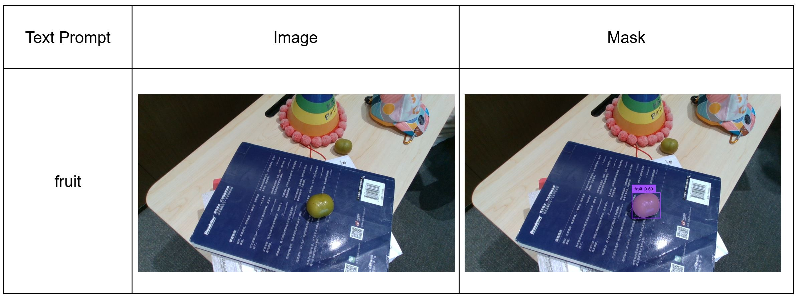
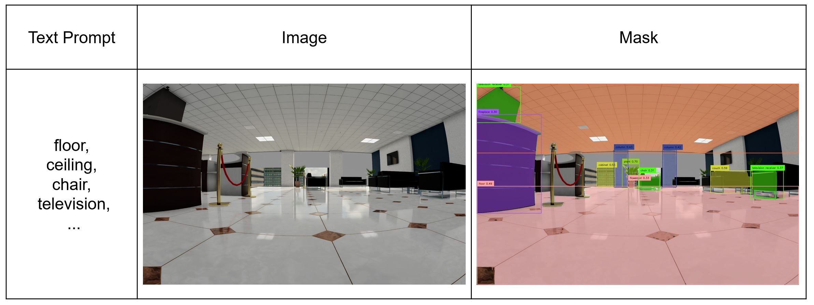

# airship_perception
**This project combines open-vocabulary object detection and semantic segmentation to achieve open-vocabulary object segmentation. The project uses Grounding DINO and SAM to achieve the segmentation of specified objects. Design details can be found in this [video](https://www.youtube.com/watch?v=umQhfnI-7mc).**

* Grasping demo

* Mapping demo

## airship_perception API Overview
### airship_perception_node
* Service
  * `airship_perception/SegmentationGrasping`: Provides a service to provide grasping node with a mask for specified objects.
  * `airship_perception/SegmentationMapping`: Provides a service to provide mapping node with the mask of the specified object.

### lib/grounded_sam_api
1. Parameters
* `grounding_dino_model`: groundingdino model. (Default: `none`)
* `sam_predictor`: sam model. (Default: `none`)
* `image`: input image. (Default: `none`)
* `classes`: objects. (Default: `none`)
* `box_threshold`: box threshold. (Default: `0.3`)
* `text_threshold`: text threshold. (Default: `0.25`)
* `nms_threshold`: nms threshold. (Default: `0.8`)
* `action`: grasp or map. (Default: `None`)

## To Do List
- [ ]  Improve object segmentation algorithms and enhance segmentation efficiency.
- [ ]  Deploy the model in the cloud and build the cloud-edge data transmission architecture.
